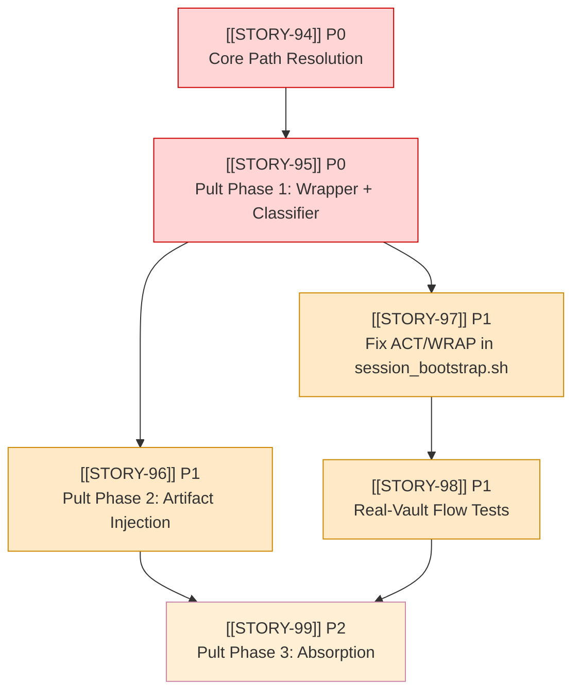

# EPIC-15: Workflow Orchestration & Pult Integration

## Objective
Resolve the 6 systemic workflow fragilities documented in `CHECKPOINT_POSTMORTEM.md` and transition the L3/L5 bootstrap logic from brittle bash heuristics to a structured, observable, and strictly validated state machine via `pult`.

## Context & Problem Statement
A checkpoint review of the workflow orchestration layer (conductor + session_bootstrap.sh) revealed 6 critical failure modes that prevent reliable, automated LLM agent execution:

1. **Prompt Context Bloat & Order:** The SYNC phase feeds ~385 lines of context (issue + specs + decisions + code state) *before* the HARD STOP instruction. The LLM reads the context, starts planning implementation, and only encounters "Do NOT write code" at the very end.
2. **Silent Diagnostic Failures:** Errors (e.g., missing `rvc` CLI, invalid paths, git failures) are swallowed or printed to an unmonitored stderr. There is no classification, no JSON logging, and no vault persistence of failure states.
3. **Synthetic Test Vacuum:** 103+ unit tests exist, but they run against ephemeral `temp_vault` fixtures. They do not test real-world friction: actual vault layout, real `rvc` CLI execution, or actual git state.
4. **Missing Phase Runner ("No Pult"):** There is no single, centralized entry point to execute the `SYNC → ENGAGE → ACT → WRAP` lifecycle with built-in error handling, artifact injection, and logging.
5. **Manual Artifact Generation:** The bootstrap script only auto-generates the `SYNC` artifact. `ENGAGE`, `ACT`, and `WRAP` artifacts are expected to be written manually by the LLM, leading to format drift, missing fields, and failed validation gates.
6. **WRAP Phase Code Mutability:** The WRAP prompt instructs the agent to "verify git status, git commit" but lacks an explicit, hard-forbidden instruction against modifying code. LLMs routinely attempt to "fix" files during the wrap phase.

## Critical User Journeys
1. **Agent starts a session:** The `pult` CLI validates the repo root, checks `rvc` availability (failing loudly if degraded), and serves a phase-specific prompt where the HARD STOP boundary is positioned *before* the context payload.
2. **Phase Transition:** An agent completes a phase. `pult` intercepts the output, validates the presence and syntax of the expected artifact template in the story `.md` file, and transitions the state machine.
3. **Observability on Failure:** A missing CLI or broken path immediately aborts the run, logs a structured JSON error to `adlai-vault/00_Project/logs/`, and surfaces a clear diagnostic message, rather than proceeding with empty context.

## Success Metrics
| Metric | Current | Target |
|---|---|---|
| Sync prompt instruction placement | End (~385th line) | **Top (first 5 lines)** |
| Error logging destination | Stderr (unstructured, transient) | **Structured JSON in `adlai-vault/00_Project/logs/`** |
| Test environment | 103 temp vault mocks | **+2 E2E tests running against real `adlai-vault` snapshot** |
| Phase execution entry point | `session_bootstrap.sh` with 4 broken phases | **`pult run STORY-XX` wrapping all 4 phases safely** |
| Artifact generation reliability | Manual (LLM-driven, prone to error) | **Automated template injection for all 4 phases** |
| WRAP phase code modification | Allowed (implicit) | **Explicitly forbidden in prompt + validated by pre-flight** |

## Child Stories

| Story | Title | Priority | Depends on | Status |
|---|---|---|---|---|
| **[[STORY-94]]** | Core Path Resolution (`paths.py`) | P0 | — | To Do |
| **[[STORY-95]]** | Pult Phase 1: Python Wrapper & Error Classifier | P0 | [[STORY-94]] | To Do |
| **[[STORY-96]]** | Pult Phase 2: Structured Artifact Injection | P1 | [[STORY-95]] | To Do |
| **[[STORY-97]]** | Fix ACT/WRAP Prompt Gates in `session_bootstrap.sh` | P1 | — | To Do |
| **[[STORY-98]]** | Real-Vault Integration Testing (Flow Tests) | P1 | [[STORY-95]], [[STORY-97]] | To Do |
| **[[STORY-99]]** | Pult Phase 3: Absorption (Deprecate Bash) | P2 | [[STORY-96]] | To Do |

## Sequencing Notes & Dependency Graph
The workflow fixes must be tackled in a specific order to avoid shifting sand. Path resolution must precede any new tooling. The bash script's ACT/WRAP bugs must be unblocked before E2E tests can pass.

## Definition of Done (Epic)
EPIC-15 is closeable when **all** hold:
- [ ] All 6 child stories (STORY-94 to STORY-99) are in Review/Done with their own acceptance criteria met.
- [ ] `backend/app/services/pult.py` exists and is the canonical entry point for session bootstrapping.
- [ ] `backend/app/services/paths.py` centralizes path resolution, validated by `assert BOOTSTRAP.exists()`.
- [ ] No bash logic remains in `session_bootstrap.sh` (fully absorbed into `pult.py`).
- [ ] All 4 phase prompts (SYNC, ENGAGE, ACT, WRAP) enforce HARD STOP boundaries at the top and explicitly forbid unauthorized actions (e.g., code mutation in WRAP).
- [ ] Every phase transition auto-injects and validates the required L3 artifact template.
- [ ] At least 2 end-to-end flow tests run successfully against a real `adlai-vault` clone, asserting the full `SYNC → ENGAGE → ACT → WRAP` lifecycle.
- [ ] QA gate: `uv run pytest backend/tests/unit -q` exits 0.
- [ ] `ruff check .` / `ruff format .` clean.

## Non-goals
- No changes to the L4 Conductor (LangGraph orchestration) core logic; `pult` remains the L5/L3 interface it calls.
- No expansion of the Obsidian vault schema beyond the existing `## L3 Artifacts` structure.
- No automated code review or semantic validation of the agent's generated code (that remains the responsibility of the QA gate: `pytest`).
