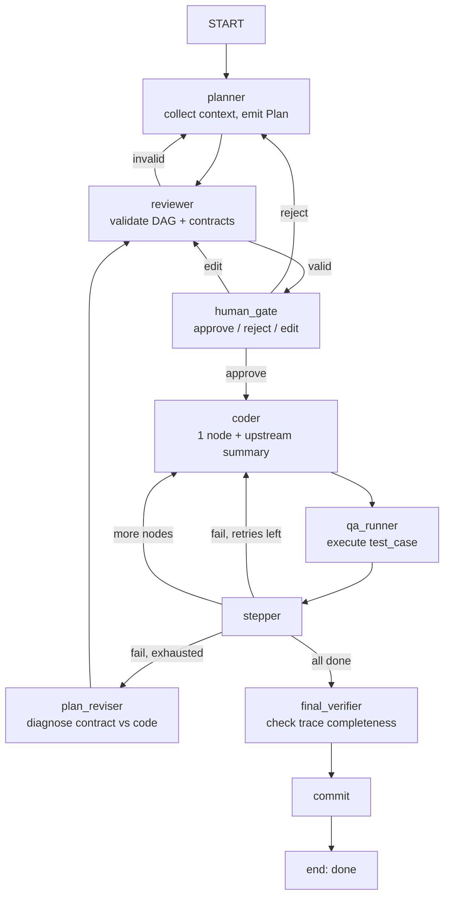

# Refined Plan v2: Verifiable Plan-Based Code Generation

## 1. Design Principles (non-negotiable)

1. **The plan is the contract.** Once locked, it is immutable. The coder works from a locked artifact, never a mutable string.
2. **Contracts must be structured.** An `expected_output` string is a hint, not a contract. We commit to structured types upfront or we admit the system is not verifiable.
3. **Measure before optimizing.** Per-node coder latency is a known cost. We do not batch siblings until we have measured it as a bottleneck.
4. **Failures feed back to the plan.** If QA fails repeatedly, the plan itself — not just the code — may be wrong. The graph must allow plan revision.
5. **Humans edit plans, not just approve them.** The human gate is not a binary button. It is an editing surface for the DAG.

---

## 2. Addressing v1 Concerns

### Concern 1: Batching siblings undermines granularity
**Resolution:** Removed. The coder sees exactly one node at a time. Latency is accepted as a design cost. We instrument it and revisit only if measurements justify it.

### Concern 2: `expected_output` as string is not a contract
**Resolution:** `expected_output` is now a structured `Contract` object, not a string. The schema is defined in Section 4. If a planner cannot emit a structured contract, the reviewer rejects the plan.

### Concern 3: No feedback loop from QA failures to plan improvement
**Resolution:** Added `plan_reviser` node. After max coder retries, the graph routes to `plan_reviser` (not `coder`) with the full QA failure log. The `plan_reviser` may adjust `test_case`, `expected_output`, or node decomposition and emit a new `Plan` version.

### Concern 4: Vault integration lacks justification
**Resolution:** Deferred to Phase 3. For the PoC, durability is SQLite + git. Vault integration is justified only for **cross-run narrative context** (e.g., linking a plan to prior story notes, specs, or architectural decisions stored as Obsidian notes). It does not replace LangGraph persistence; it augments planner context. If you do not need narrative cross-referencing, you do not need the vault.

### Concern 5: Human gate is binary, cannot fix DAG issues
**Resolution:** The human gate receives the structured `Plan` JSON and can return an edited version. The `reviewer` re-validates the human-edited plan before locking. Rejection without edits routes back to `planner`; edited plans route through `reviewer` again.

---

## 3. Context Collection Architecture

Before the planner emits a plan, it must collect context. This is documented explicitly because it is a common source of silent failures.

### 3.1 Context Sources (in priority order)

| Source | What it provides | How it is collected |
|--------|---------------|-------------------|
| **AGENTS.md / CLAUDE.md** | Project conventions, tech stack, forbidden patterns | Read from disk at `plan_node` start |
| **Git state** | Recent commits, active branch, uncommitted changes | `git log --oneline -20`, `git status --short` |
| **Task description** | The user's natural language request | Direct input to `RunState.task` |
| **Prior plan history** | Previous attempts, rejection notes, QA failures | From `RunState.history` and `rejection_note` |
| **Vault notes (Phase 3)** | Narrative specs, architectural decisions, story context | `VaultLedger.get_relevant_notes()` |

### 3.2 Context Assembly Prompt

The planner prompt is assembled in this exact order:

```
[SYSTEM CONTRACT]
<AGENTS.md content>

[REPOSITORY CONTEXT]
Branch: <branch>
Recent commits:
<git log --oneline -10>
Uncommitted changes:
<git status --short>

[TASK]
<RunState.task>

[PRIOR ATTEMPTS]
<If RunState.rejection_note or QA failure log exists, include it here>

[INSTRUCTIONS]
Emit a Plan JSON conforming to the schema below. Do not write code. Do not modify files.
```

**Why this order:** The contract is first so the planner knows constraints. Git context grounds the plan in reality. Prior attempts prevent repetition.

### 3.3 Context Drift Guard

The `coder` node receives **only**:
- The locked `Plan` object
- The current `TaskNode` (id, description, contract)
- A distilled summary of upstream node results (not the full plan)

It does **not** receive:
- The original user task (prevents re-interpreting scope)
- Downstream node descriptions (prevents anticipating future work)
- AGENTS.md in full (prevents re-deriving conventions)

---

## 4. Schema (Structured Contracts)

```python
from typing import TypedDict, Literal

class Contract(TypedDict):
    """A structured output contract, not a hint."""
    type: Literal["function", "schema", "assertion"]
    # For type="function": name and signature the node must implement
    signature: str | None
    # For type="schema": JSONSchema the output must validate against
    json_schema: dict | None
    # For type="assertion": a predicate that must hold
    predicate: str | None

class TaskNode(TypedDict):
    id: str
    description: str
    dependencies: list[str]          # DAG adjacency list
    contract: Contract                 # structured, not a string
    test_case: str                   # executable test script or assertion
    artifact_path: str | None        # where the coder writes output

class Plan(TypedDict):
    id: str
    version: int
    nodes: list[TaskNode]
    topo_order: list[str]             # computed by reviewer at lock time

class RunState(TypedDict, total=False):
    project: str
    task: str
    contract: str                    # AGENTS.md content
    plan: Plan | None
    plan_locked: bool
    current_node_idx: int            # index into topo_order
    errors: list[str]
    history: list[dict]
    status: Literal[
        "planning", "reviewing", "awaiting_approval",
        "acting", "qa", "plan_revising", "done",
        "qa_failed", "rejected"
    ]
    commit_sha: str
    rejection_note: str
    qa_log: str
    qa_attempts: int
```

**Key change from v1:** `expected_output: str` is dead. Long live `contract: Contract`. If the planner emits a string, the reviewer rejects it.

---

## 5. Pipeline Nodes (Revised Flow)

### 5.1 planner
- Collects context per Section 3.
- Emits a `Plan` JSON. `version` starts at 1.
- Does not write files. `read_only=True` enforced by worker config.

### 5.2 reviewer
- Validates:
  1. DAG acyclicity (topological sort succeeds)
  2. Every `dependency` id exists in `nodes`
  3. Every `TaskNode` has a valid `Contract` (structured, not string)
  4. Every `TaskNode` has non-empty `test_case`
  5. `artifact_path` is within the project repo (path traversal guard)
- Computes `topo_order` and writes it into the `Plan`.
- On failure: appends structured errors to `RunState.errors` and routes back to `planner`.
- On success: sets `plan_locked=True`, routes to `human_gate`.

### 5.3 human_gate
- Receives the structured `Plan` JSON.
- Can return:
  - `{"approved": true}` → routes to `coder`
  - `{"approved": false, "note": "..."}` → routes to `planner` (rejection)
  - `{"edited_plan": <Plan JSON>}` → routes back to `reviewer` for re-validation
- **This is the editing surface.** Humans fix DAG issues here, not by rejecting and hoping.

### 5.4 coder
- Receives **only** the current `TaskNode` and a distilled upstream summary.
- Implements the node. Writes artifact to `artifact_path`.
- Does not see downstream nodes. Does not see the original task.

### 5.5 qa_runner
- Looks up `TaskNode.test_case` for the current node.
- Executes the test in an isolated subprocess against the artifact.
- Returns `pass/fail` + `stdout/stderr`.

### 5.6 stepper
- If QA passed: increments `current_node_idx`.
  - If more nodes exist: routes to `coder`.
  - If all nodes done: routes to `final_verifier`.
- If QA failed and `qa_attempts < max_qa_retries`: routes to `coder` with failure log.
- If QA failed and `qa_attempts >= max_qa_retries`: routes to `plan_reviser`.

### 5.7 plan_reviser
- Receives the full QA failure log + the locked `Plan`.
- Diagnoses whether the failure is:
  - **Coder error:** bad implementation (should not happen here; stepper already retried)
  - **Contract error:** `test_case` or `contract` is impossible/wrong
  - **Decomposition error:** node is too large, needs splitting
- Emits a new `Plan` with incremented `version`.
- Routes to `reviewer`.
- **This is the critical feedback loop missing in v1.**

### 5.8 final_verifier
- Does not read code.
- Verifies that `history` contains a `qa_passed=True` entry for every node in `topo_order`.
- Routes to `commit` or `end` with status `qa_failed`.

### 5.9 commit
- Unchanged from current conductor.

---

## 6. Execution Flow (Revised Mermaid)



---

## 7. Bottlenecks (Honest Assessment)

| # | Bottleneck | Why it is real | Mitigation | When to apply |
|---|-----------|----------------|------------|---------------|
| 1 | **Plan Validation Loop** | Planner → Reviewer retry is expensive if DAGs are consistently invalid | Inject DAG validation examples into planner prompt; cap retries at 3 | Always |
| 2 | **Per-Node Coder Latency** | N nodes = N CLI calls. This is a design cost, not a bug. | None. Measure first. If >30s/node average, consider parallelizing independent branches | Only after measurement |
| 3 | **Test Case Quality** | Planner-generated `test_case` may be wrong | Reviewer validates test semantics against `Contract` at lock time | Always |
| 4 | **Plan Reviser Accuracy** | Diagnosing whether failure is contract vs code is hard | Keep `plan_reviser` prompt conservative: prefer coder retry over plan revision unless evidence is strong | Always |
| 5 | **Human Gate Friction** | Editing JSON is not user-friendly | Provide a markdown rendering of the plan for human reading; accept edited JSON back | Always |
| 6 | **State Checkpoint Bloat** | SQLite persists full `GraphState` | Store large `Plan` objects in a side file; keep `RunState` as a reference + metadata | Always |
| 7 | **Contract Drift** | Ambiguous `Contract` causes coder/QA disagreement | Enforce `Contract.type` enum; reject unstructured contracts at review | Always |

---

## 8. Simplest PoC Definition

**Goal:** Prove that a structured, locked plan improves reliability over a string plan, with minimal code change.

**What the PoC includes:**

1. **Schema** (`conductor/schema.py`): `Contract`, `TaskNode`, `Plan` dataclasses.
2. **Planner upgrade**: `plan_node` emits JSON that deserializes to `Plan`. Planner still sees whole task.
3. **Reviewer node**: New node between `plan` and `human_gate`. Validates DAG + contracts. Computes `topo_order`.
4. **Human gate upgrade**: Accepts edited `Plan` JSON, routes edited plans back to reviewer.
5. **Coder downgrade (for PoC only)**: The `coder` receives the **entire locked plan**, not one node. This is intentional — we are testing plan-as-contract, not per-node execution. The plan is still locked and immutable.
6. **QA unchanged**: Project-level `qa_cmd`. We are not building per-node QA yet.
7. **Plan reviser stub**: After max QA retries, route to a `plan_reviser` node that simply appends a note to `rejection_note` and routes to `planner`. The logic can be hollow; the graph edge must exist.

**What the PoC explicitly excludes:**
- Per-node coder execution (deferred to Phase 2)
- Per-node QA harness (deferred to Phase 2)
- Vault integration (deferred to Phase 3)
- Parallel branch execution (deferred until latency is measured)
- Complex `plan_reviser` logic (stub only)

**Success criteria for PoC:**
1. Planner emits a `Plan` with 3+ nodes and valid DAG.
2. Reviewer rejects plans with cycles or missing dependencies.
3. Human can edit the plan at the gate and the edited plan is re-validated.
4. Coder receives a locked plan (versioned, immutable) and implements it.
5. If QA fails 3 times, the graph routes back to planner with failure context.
6. A successful run produces a commit and a complete execution trace in `history`.

**Estimated surface area:**
- New file: `conductor/schema.py` (~60 lines)
- Modified: `conductor/pipeline.py` — add `reviewer`, `plan_reviser`, upgrade `human_gate`, upgrade `plan_node` (~120 lines changed)
- Modified: `conductor/projects_config.py` — add `reviewer` routing if needed (~5 lines)
- No new dependencies.

---

## 9. Phase Roadmap (Post-PoC)

| Phase | What | Trigger |
|-------|------|---------|
| **Phase 1: PoC** | Structured plan + reviewer + human edit + plan reviser stub | Now |
| **Phase 2: Granular Execution** | Coder sees 1 node; QA is per-node test harness | PoC success criteria met |
| **Phase 3: Vault Context** | `VaultLedger` feeds narrative context into planner; plans written as vault notes | Need cross-run narrative linking |
| **Phase 4: Parallelization** | Independent DAG branches execute in parallel | Per-node latency measured >30s/node |

---

## 10. Open Questions

1. Should `Contract` support multiple types simultaneously (e.g., both `signature` and `json_schema`)? Or is one type strict enough?
2. Should the human gate render the plan as a markdown table for readability, or is raw JSON acceptable for the PoC?
3. What is the maximum plan size (node count) we expect? This affects whether we need to paginate the plan in the coder prompt.
