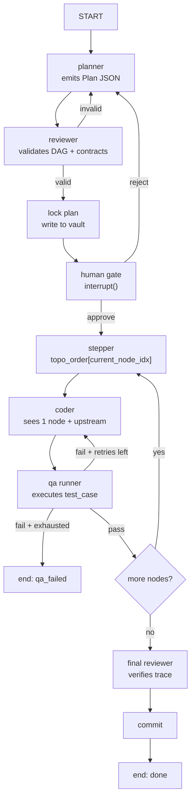

# Refined Plan: Verifiable Plan-Based Code Generation with Obsidian Vault Integration

## 1. Executive Summary

Transform the current [`conductor/pipeline.py`](conductor/pipeline.py:1) from a flat `plan → approve → act → qa → commit` flow into a **structured DAG pipeline** where the `Plan` is a versioned, machine-readable artifact. The [`agentic/bridge.py`](agentic/bridge.py:1) vault-walker becomes the durable context layer for plans, contracts, and execution traces.

**Core principle:** The plan is the contract. The coder never sees a mutable plan; it sees one locked node at a time. QA is deterministic per-node, not a subjective review of a code blob.

---

## 2. Architecture Delta: Current vs Target

| Layer | Current State | Target State |
|-------|--------------|--------------|
| **Plan** | Unstructured string in [`RunState.plan`](conductor/pipeline.py:33) | Typed `Plan` DAG with `TaskNode` objects, dependencies, and contracts |
| **Review** | Human approval gate only | Machine reviewer validates DAG acyclicity + contract completeness **before** human gate |
| **Coder** | Sees entire plan string | Sees only current `TaskNode` + upstream contract summary |
| **QA** | Single project-level shell command ([`qa_cmd`](conductor/projects/adlai.toml:9)) | Per-node `test_case` executed by a deterministic runner |
| **Vault** | Narrative context only ([`NarrativeAgent`](agentic/bridge.py:9)) | Durable store for locked plans, execution traces, and node-level test definitions |

---

## 3. Phase-by-Phase Implementation

### Phase 1: Schema & Plan Lock (Foundation)

**Goal:** Replace the string `plan` with a structured, serializable `Plan` DAG.

**Actions:**
1. Define [`TaskNode`](conductor/pipeline.py:25) and [`Plan`](conductor/pipeline.py:32) dataclasses in a new `conductor/schema.py`.
2. Add `dependencies: list[str]` to `TaskNode` to support DAG topology.
3. Add `test_case: str` and `expected_output: str` fields to `TaskNode` as the coder/QA contract.
4. Modify [`plan_node`](conductor/pipeline.py:60) to emit JSON that deserializes into a `Plan` object.
5. Add a `review_node` (machine reviewer) between `plan` and `approve` that:
   - Validates DAG acyclicity via topological sort
   - Confirms every `dependency` ID exists in the graph
   - Checks every node has non-empty `expected_output` and `test_case`
   - Rejects the plan with a structured error log if any check fails

**🚨 Bottleneck: Plan Validation Loop**
- If the planner consistently emits invalid DAGs (missing dependencies, cycles), the `plan → review → plan` retry loop becomes expensive.
- **Mitigation:** Inject a DAG validation prompt example into the planner's system contract so the smart model plans valid graphs by construction.

---

### Phase 2: Per-Node Coder Execution (Granularity)

**Goal:** The coder receives only one node at a time, preventing hallucinated side effects.

**Actions:**
1. Replace the monolithic [`act_node`](conductor/pipeline.py:101) with a `coder_node` that:
   - Accepts `current_node_id: str` and `upstream_results: dict[str, Any]`
   - Reads the locked `Plan` to extract the current `TaskNode`
   - Builds a prompt containing only: the node's `description`, `expected_output`, and distilled upstream contracts
2. Add a `stepper_node` that:
   - Computes the topological execution order at plan-lock time
   - Advances `current_node_idx` after each successful QA pass
   - Routes to `commit` when all nodes are exhausted

**🚨 Bottleneck: Coder Latency Multiplication**
- A plan with 8 nodes now requires 8 separate CLI invocations instead of 1.
- **Mitigation:** Batch independent nodes (parallel branches in the DAG) into a single coder prompt. The stepper identifies sibling nodes with no inter-dependencies and passes them together.

---

### Phase 3: Deterministic Per-Node QA (Verification)

**Goal:** Replace the subjective QA review with a test runner that validates each node against its pre-defined `test_case`.

**Actions:**
1. Add a `test_harness.py` module that:
   - Receives a `TaskNode.test_case` string and the node's generated code artifact
   - Executes the test in an isolated subprocess (timeout, sandboxed)
   - Returns `pass/fail` with `stdout/stderr`
2. Modify [`qa_node`](conductor/pipeline.py:122) to:
   - Look up the current node's `test_case`
   - Run the harness against the artifact produced by the coder
   - Append results to `history` and route accordingly
3. Add a `final_reviewer_node` that:
   - Does not re-read code
   - Verifies the `history` execution trace matches the `Plan`'s expected outcomes
   - Acts as the final deterministic gate before `commit`

**🚨 Bottleneck: Test Case Quality**
- The planner writes the `test_case`. If the test is wrong (e.g., asserts incorrect behavior), the QA gate will fail valid code or pass invalid code.
- **Mitigation:** Make `test_case` generation a two-step process: planner drafts → reviewer validates test semantics against `expected_output` during the plan-lock stage.

---

### Phase 4: Obsidian Vault Integration (Durability)

**Goal:** The vault becomes the source of truth for locked plans, execution traces, and contracts.

**Actions:**
1. Extend [`NarrativeAgent`](agentic/bridge.py:9) into a `VaultLedger` class that:
   - Writes locked `Plan` objects as markdown notes with JSON frontmatter
   - Appends execution events to a daily run log note
   - Reads historical plans and traces for context in the planner prompt
2. Vault note structure:
   ```markdown
   ---
   plan_id: user-add-20260626
   version: 1
   status: locked
   nodes: 3
   ---
   # Plan: user-add
   
   ## Node: parse_request
   - expected_output: valid_request_params
   - test_case: "input={'id':1} -> expected: {'parsed':true}"
   ```
3. Integrate `VaultLedger` into pipeline nodes:
   - `review_node`: writes the locked plan to vault on success
   - `qa_node`: appends test results to the plan's note
   - `commit_node`: updates plan status to `committed` with SHA

**🚨 Bottleneck: Vault I/O on Every Transition**
- File-system writes on every node advance add latency and risk race conditions if multiple runs target the same vault.
- **Mitigation:** Batch vault writes. The `stepper_node` writes only when advancing stages (plan-lock, QA complete, final verification), not on every micro-transition. Use atomic file moves for safety.

---

## 4. Risk Register: Bottlenecks & Mitigations

| # | Bottleneck | Impact | Mitigation |
|---|-----------|--------|------------|
| 1 | **Plan Validation Loop** | Planner → Reviewer retry is expensive if DAGs are consistently invalid | Inject DAG validation examples into planner contract; cap retries at 3 |
| 2 | **Coder Latency Multiplication** | N nodes = N CLI calls | Batch independent sibling nodes into single coder prompts |
| 3 | **Test Case Quality** | Planner-generated tests may be wrong | Reviewer validates test semantics against `expected_output` at lock time |
| 4 | **Vault I/O Latency** | File writes on every transition slow execution | Batch writes to stage boundaries; use atomic moves |
| 5 | **State Checkpoint Bloat** | LangGraph SQLite persists full `GraphState` including plan graph | Store large plan artifacts in vault; keep `GraphState` lean with references only |
| 6 | **Dependency Serialization** | DAG linearization forces sequential execution even where parallel is possible | Identify sibling nodes in stepper; parallelize coder/QA for independent branches |
| 7 | **Contract Drift** | Ambiguous `expected_output` causes coder/QA disagreement | Enforce structured output types (JSONSchema) in `expected_output` field |

---

## 5. LangGraph State Evolution

```python
class TaskNode(TypedDict):
    id: str
    description: str
    dependencies: list[str]
    expected_output: str          # contract for coder
    test_case: str                # contract for QA runner
    artifact: str | None          # generated code (populated by coder)
    qa_passed: bool | None        # populated by QA
    qa_log: str                   # stdout/stderr from test harness

class Plan(TypedDict):
    id: str
    version: int
    nodes: list[TaskNode]
    topo_order: list[str]         # computed at lock time

class RunState(TypedDict, total=False):
    project: str
    task: str
    contract: str
    plan: Plan | None             # structured, not a string
    plan_locked: bool             # set by reviewer
    current_node_idx: int         # index into topo_order
    errors: list[str]
    history: list[dict]
    status: str
    commit_sha: str
```

---

## 6. Execution Flow (Mermaid)



---

## 7. Integration Checklist for Existing Projects

1. **Add `test_case` fields** to existing AGENTS.md contract templates so planners know to generate them.
2. **Create vault directory** `00_Plans/` for locked plan artifacts.
3. **Upgrade `qa_cmd`** from a single project-level command to a node-level harness invocation.
4. **Add `reviewer` routing** in `conductor/projects/<name>.toml` if you want a different model for plan validation than for planning.
5. **Enable read-only mode** on the planner worker to guarantee it never writes files during plan generation.
